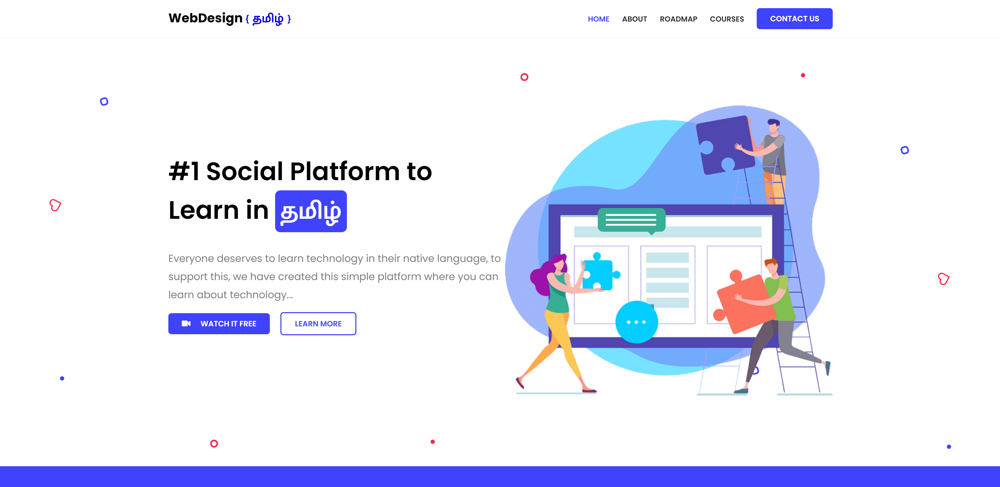

# Modern Web Landing Page using SASS & JS 🧑‍💻

Learn to build Modern landing page built on HTML, CSS, SASS &amp; Javascript in Tamil. We are going to build realtime website from scratch, beginner friendly.

✨ Live: https://anburocky3.github.io/webdesign-tamil/

#### Screenshots (What we gonna learn at the end!)

#### Download Resources:

1. [Presentation PPT](https://raw.githubusercontent.com/anburocky3/webdesign-tamil/master/supporting-files/building-landing-page-using-sass.pptx)
2. [Download images](https://raw.githubusercontent.com/anburocky3/webdesign-tamil/master/supporting-files/images.zip)

#### How to proceed?

In order to learn everything detaily, we have splitted each topic in a separate video, below you can find all the commits, feature-wise.

#### 👉 Checkout [all commits here:](https://github.com/anburocky3/webdesign-tamil/commits/master)

#### Authors:

- Anbuselvan Rocky ([Facebook](https://fb.me/anburocky))

#### License - MIT
